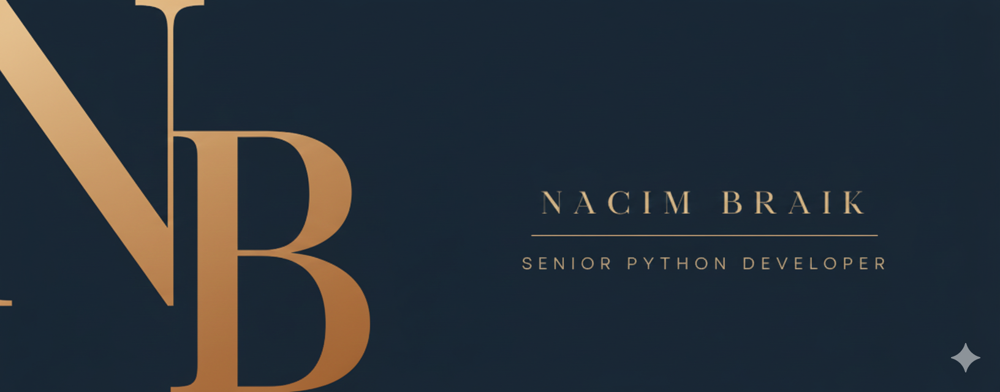

<h1 align="center">Hi 👋, I'm Nacim Braik</h1>
<h3 align="center">A passionate Programmer from Tizi Ouzou</h3>

I am fascinated by how computer technology 🌐 continues to transform our lives in ways that were once unimaginable. Witnessing the growth of software and computing inspired me to pursue software engineering from an early age, and my passion for it has only grown since then. I particularly enjoy working with Python 🐍, exploring new libraries and frameworks, and leveraging them to build innovative and practical solutions 🛠️

  
  
  
  
  
 

 

  
  
  
  
  
  

  

- 🔭 I’m currently open to a new Job

- 🌱 I’m currently learning **Devops**

- 💬 Ask me about **Python, Django, FastAPI and React**

- 📫 How to reach me **nosbraik@gmail.com**

- 📄 Know about my experiences [my experiences](http://nos.traditionalme.life/#resume)

- ⚡ Fun fact **I think I'm funny**

 
<h3 align="left">Connect with me:</h3>

 

<!--  -->

<h3 align="left">Languages and Tools:</h3>

- Backend

  

- Frontend

  

- Database

  

- Cloud Servers

  

- Tools

  

 

<!--  -->
